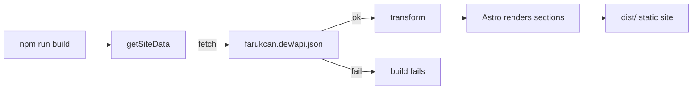

# farukcan_web

Static personal website for **Faruk Can**, generated with [Astro](https://astro.build).
All content is pulled from `https://farukcan.dev/api.json` at build time, so the site
re-syncs itself on every build. Design language mirrors kadiryaren.dev (Apple-style dark
theme, Tailwind, CSS animations).

## Commands

```bash
npm install      # install dependencies
npm run dev      # local dev server
npm run build    # static build into dist/ (re-fetches api.json)
npm run preview  # preview the production build
```

## How it self-updates

Both `dev` and `build` fetch live data from `https://farukcan.dev/api.json`. If the
endpoint is unreachable, the command fails — there is no local snapshot fallback.



## Data mapping

| Site section | Source in api.json |
| ------------ | ------------------ |
| Hero role/tagline | `homePage.content` callout + `configuration` |
| Skills cards | `homePage.content` `<details>` blocks |
| Tech marquee | project `Tags` (deduped) |
| Projects grid | `databases[<id>].list` (Name, Status, Tags, Link, cover/icon, description) |
| Socials | anchors in `homePage.content` + `configuration.twitter_username` |

The transform lives in [`src/lib/data.ts`](src/lib/data.ts). Images use the stable
`/assets/...` paths served from `https://farukcan.dev` (Notion S3 signed URLs expire and
are intentionally not used).
