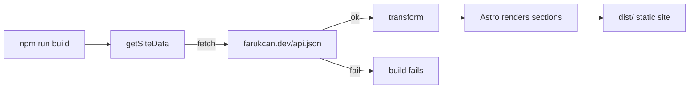
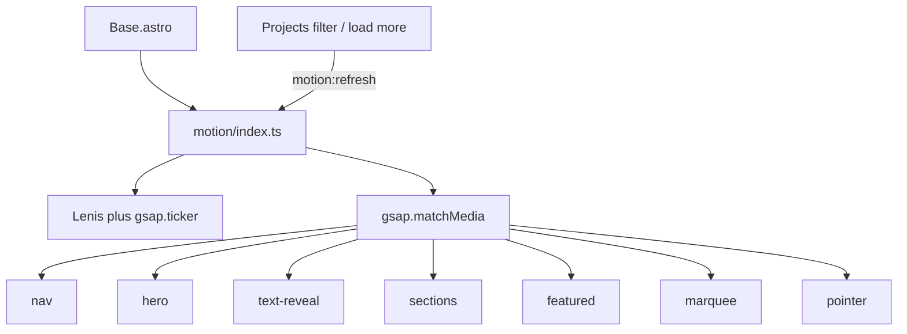
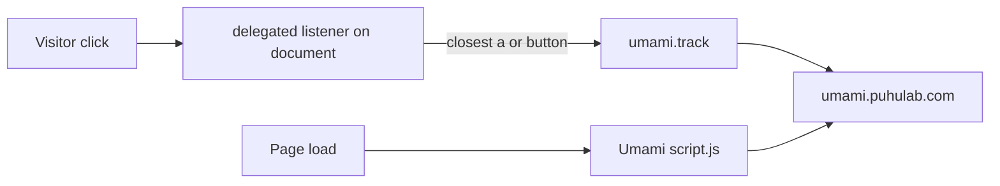
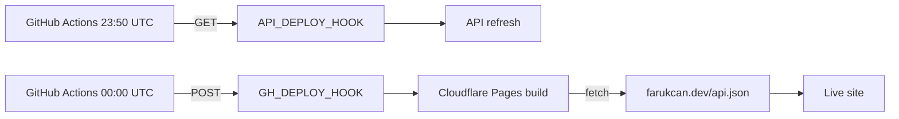
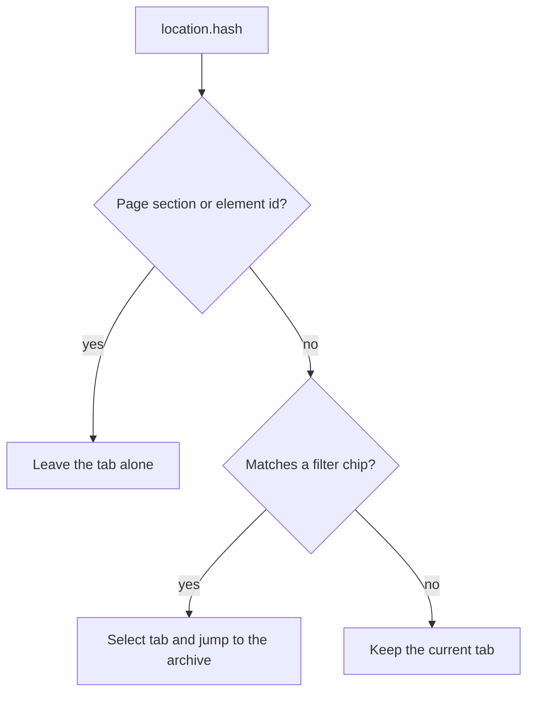

# farukcan_web

Static personal website for **Faruk Can**, generated with [Astro](https://astro.build).
All content is pulled from `https://farukcan.dev/api.json` at build time, so the site
re-syncs itself on every build. Design language is Apple-style dark theme,
Tailwind, and GSAP + Lenis scroll choreography.

## Commands

```bash
npm install      # install dependencies
npm run dev      # local dev server
npm run build    # static build into dist/ (re-fetches api.json)
npm run preview  # preview the production build
```

## How it self-updates

Both `dev` and `build` fetch live data from `https://farukcan.dev/api.json`. If the
endpoint is unreachable, the command fails — there is no local snapshot fallback.



## Data mapping

| Site section | Source in api.json |
| ------------ | ------------------ |
| Hero role/tagline | `homePage.content` callout + `configuration` |
| Services grid | `databases[9f578cf4-…].list` (Name, Description, Priority) + `nav` Services frontmatter (`hideTitle`, title, desc); icons from row `icon` |
| Skills cards | `homePage.content` `<details>` blocks |
| Tech marquee (3-row endless scroll) | project `Tags` (deduped, shuffled per row) |
| Featured showcase | First 5 `Published` projects (same sort as the grid). If fewer than 3 are Published, falls back to the first 5 overall. Rendered by [`FeaturedProjects.astro`](src/components/FeaturedProjects.astro); card click opens the existing `project-dialog-{id}` |
| Projects grid | `databases[59410d89-…].list` (Name, Status, Tags, Link, Date, cover/icon, description); card `description` is `frontmatter.firstParagraphs` run through `htmlToPlainText` (decode entities, strip tags); Status `Removed` is filtered out; `Published` first, then by `Priority` desc; each filter tab shows 20 cards then **Load More N Projects** for the rest. Card click opens a `<dialog>` with `parsedContent` (Notion HTML), Tags, and Date under the title; **Open Link** (header, left of Close) goes to `Link` when set. Icons: file/emoji via `iconURL`; Notion library icons via row `icon` → `NotionIcon` |
| Socials | anchors in `homePage.content` + `configuration.twitter_username` |
| Head / OG / Twitter meta | `configuration.title`, `description`, `site_url`, `twitter_username` (+ static `/og.png`) |

Services rows are sorted by `Priority` ascending (per `[DatabaseSort=Priority]`), with name as a stable tie-break. Row icons use Notion native `icon.name` → [`public/notion-icons/{name}.svg`](public/notion-icons) via [`NotionIcon.astro`](src/components/NotionIcon.astro). Projects use the same path when `iconURL` is empty (`icon.type === "icon"`). API names that differ from local SVG filenames are remapped in [`src/lib/notionIcons.ts`](src/lib/notionIcons.ts) (`ICON_ALIASES`); unknown names fall back to `sparkle`. If data looks stale, check the root `timestamp` on `api.json` — Notion rebuilds lag ~10–15 minutes.

The transform lives in [`src/lib/data.ts`](src/lib/data.ts). Images use the stable
`/assets/...` paths served from `https://old.farukcan.dev` (Notion S3 signed URLs expire and
are intentionally not used).

## Motion

Scroll choreography lives in [`src/scripts/motion`](src/scripts/motion) and is
imported from [`src/layouts/Base.astro`](src/layouts/Base.astro). GSAP (core +
ScrollTrigger + SplitText) and Lenis share one `gsap.ticker` loop. If init
throws, the `js` class is removed so every motion target stays visible.



| matchMedia | What it enables |
| ---------- | --------------- |
| `(min-width: 768px)` | Hero pin, featured horizontal pin, char-level splits |
| `(max-width: 767px)` | Mobile menu, snap-x featured, word-level splits, no pins |
| `(pointer: fine)` | Custom cursor, magnetic buttons, 3D tilt |
| `(prefers-reduced-motion: reduce)` | Lenis and all scroll tweens are skipped |

`motion:refresh` is a `window` event. The projects filter / load-more script
dispatches it after changing `display` so ScrollTrigger recomputes positions.
`motion:lock` / `motion:unlock` stop Lenis and hide the custom cursor (used
while a project dialog or the mobile menu is open).
`motion:scroll-to` is a `CustomEvent` (`detail.id`, `detail.immediate`) from the
projects hash handler; motion scrolls that element with Lenis after a
ScrollTrigger refresh. `motion:ready` fires when motion has booted or was
skipped, so that scroll does not run before pins exist.

| Attribute | Role |
| --------- | ---- |
| `data-reveal` | Fade/rise on enter; reverses on the way back up |
| `data-reveal-group` | Staggered `ScrollTrigger.batch` for child `data-reveal` |
| `data-split="words\|chars\|lines"` | SplitText scrub reveal |
| `data-parallax="<px>"` | Vertical drift while the section crosses the viewport |
| `data-magnetic` | Pull toward the pointer (also `.btn-primary` / `.btn-ghost`) |
| `data-tilt` | 3D tilt + spotlight (`--mx` / `--my`) |
| `data-cursor="Open"` | Custom cursor grows and shows the label |
| `data-marquee` | Endless row; `data-direction`, `data-duration`, `data-phase` |
| `data-featured` | Pinned horizontal showcase (desktop) / scroll-snap (mobile) |

## Analytics (Umami)

Privacy-friendly pageviews + click events via self-hosted [Umami](https://umami.is) at `umami.puhulab.com`. The tracker script is injected in [`src/layouts/Base.astro`](src/layouts/Base.astro).



| What | How |
| ---- | --- |
| Pageviews | Automatic (`data-auto-track` default) |
| `<a>` / `<button>` clicks | Global delegated listener → `umami.track(name, data)` |
| Event name | `{tag}: {label}` (max 50 chars; label from aria-label, `data-filter`, id, `h3`, or text) |
| Event data | `tag`, `label`, optional `href` / `id` / `filter` |

JS tracking is used instead of `data-umami-event` so other click handlers (project filters, load more) keep working. Skills Notion HTML links are covered by the same listener. The tracker only runs on `farukcan.dev` / `www` / `old.farukcan.dev` (`data-domains`), so local `astro dev` does not pollute analytics.

## Performance

Build-time optimizations keep the static site on a single origin at runtime:

| Topic | Approach |
| ----- | -------- |
| Motion (GSAP + Lenis) | One deferred module; pins / cursor / tilt disabled on small screens and `prefers-reduced-motion`; only `transform` / `opacity` are animated |
| Handwriting font (Caveat) | Self-hosted via `@fontsource/caveat` (latin 400 only); no Google Fonts |
| Project covers / icons | Astro `<Image>` + `sharp`; remote URLs from `old.farukcan.dev` authorized in [`astro.config.mjs`](astro.config.mjs) and optimized into `dist/_astro/` at build |
| Cache | [`public/_headers`](public/_headers) for Cloudflare Pages: hashed `/_astro/*` immutable; HTML short TTL; branding assets 1 week; manifest 1 day (no catch-all `/*`, so rules do not merge) |
| SEO | [`@astrojs/sitemap`](astro.config.mjs) + [`public/robots.txt`](public/robots.txt) |

Each deploy still needs `api.json` **and** reachable cover/icon URLs; a missing remote image fails the build.

## Branding assets

Logo and favicons mirror [farukcan.dev](https://farukcan.dev) (sourced from
`farukcan/farukcan.github.io` images). They live in [`public/`](public/):

| File | Use |
| ---- | --- |
| `logo.png` / `android-chrome-512x512.png` | Brand mark (also keep `src/assets/logo.png` in sync for optimized Nav `<Image>`) |
| `og.png` | Open Graph / Twitter share image (1200×630) |
| `favicon.ico`, `favicon-16x16.png`, `favicon-32x32.png` | Browser favicon |
| `apple-touch-icon.png` | iOS home screen |
| `android-chrome-192x192.png` / `android-chrome-512x512.png` | Web app manifest icons |
| `manifest.webmanifest` | Install / Add to Home Screen metadata |
| `robots.txt` | Crawler rules + sitemap URL |
| `notion-icons/*.svg` | Notion page icons (`{name}.svg`); used by `NotionIcon.astro` |

## Cloudflare Pages

Static Astro output (`dist/`) deploys directly to Cloudflare Pages. No adapter required.

1. Cloudflare Dashboard → **Workers & Pages** → **Create** → **Connect to Git**
2. Select this repo and use the build settings below
3. (Optional) Attach a custom domain and point DNS at Cloudflare

| Setting | Value |
| ------- | ----- |
| Framework preset | Astro (or None) |
| Build command | `npm run build` |
| Build output directory | `dist` |
| Root directory | `/` (repo root) |
| Node version | `20` (via [`.nvmrc`](.nvmrc) or env `NODE_VERSION=20`) |

[`public/_headers`](public/_headers) is copied into `dist/` and applied by Cloudflare Pages automatically (security headers globally; long-cache for `/_astro/*`; 1h for HTML; 1 week for branding assets).

Each deploy re-fetches `https://farukcan.dev/api.json` and optimizes remote project images. If the API or those images are down, the build fails.

### Scheduled redeploy (Saima sync)

Two GitHub Actions run daily so the API refreshes before the site rebuilds:

1. [`.github/workflows/daily-api-deploy.yml`](.github/workflows/daily-api-deploy.yml) at **23:50 UTC** (02:50 Turkey) GETs `API_DEPLOY_HOOK`
2. [`.github/workflows/daily-deploy.yml`](.github/workflows/daily-deploy.yml) at **00:00 UTC** (03:00 Turkey) POSTs to `GH_DEPLOY_HOOK` so Cloudflare Pages rebuilds against the latest `api.json`

You can also run either manually via **Actions → … → Run workflow**.

1. Create the deploy hooks for the API and for Cloudflare Pages
2. GitHub repo → **Settings → Secrets and variables → Actions** → add secrets `API_DEPLOY_HOOK` and `GH_DEPLOY_HOOK` with the hook URLs



### Path → hash redirects

Unknown paths are handled by [`src/pages/404.astro`](src/pages/404.astro): `/$x` redirects client-side to `/#$x` (e.g. `/contact` → `/#contact`). Paths that look like files (contain a `.`) fall back to `/`. This avoids a catch-all `_redirects` rule, which on Cloudflare Pages would override real static assets.

### Project filter hashes

On load and on `hashchange`, [`Projects.astro`](src/components/Projects.astro) reads the fragment. If it matches a project filter chip, that tab is selected and the page jumps to `#project-archive` (the archive heading and filters, past the pinned featured scroller). Matching ignores case and punctuation (`Desktop App` ≡ `#desktop-app`) and accepts one trailing plural `s` when the stem is at least 3 characters (`#games` → `Game`). Page-section hashes (`#hero`, `#services`, `#projects`, `#about`, `#skills`, `#contact`) and any fragment that is already an element id keep normal in-page scrolling and do not change the active tab.



### Hide contact UI

Append `?no-contact-info=yes` to the URL to hide Contact nav/CTA links, the Contact section, and footer social links (replaced with “Contact Info is hidden”). Example: `/?no-contact-info=yes`. The `/games` path redirects to `/?no-contact-info=yes#projects` for the same effect (that hash is the projects section, so it does not select the Game tab; `/#games` does).
