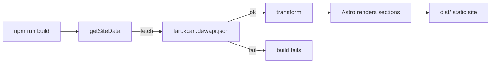

# farukcan_web

Static personal website for **Faruk Can**, generated with [Astro](https://astro.build).
All content is pulled from `https://farukcan.dev/api.json` at build time, so the site
re-syncs itself on every build. Design language mirrors kadiryaren.dev (Apple-style dark
theme, Tailwind, CSS animations).

## Commands

```bash
npm install      # install dependencies
npm run dev      # local dev server
npm run build    # static build into dist/ (re-fetches api.json)
npm run preview  # preview the production build
```

## How it self-updates

Both `dev` and `build` fetch live data from `https://farukcan.dev/api.json`. If the
endpoint is unreachable, the command fails — there is no local snapshot fallback.



## Data mapping

| Site section | Source in api.json |
| ------------ | ------------------ |
| Hero role/tagline | `homePage.content` callout + `configuration` |
| Skills cards | `homePage.content` `<details>` blocks |
| Tech marquee (3-row endless scroll) | project `Tags` (deduped, shuffled per row) |
| Projects grid | `databases[<id>].list` (Name, Status, Tags, Link, cover/icon, description) |
| Socials | anchors in `homePage.content` + `configuration.twitter_username` |

The transform lives in [`src/lib/data.ts`](src/lib/data.ts). Images use the stable
`/assets/...` paths served from `https://farukcan.dev` (Notion S3 signed URLs expire and
are intentionally not used).

## Branding assets

Logo and favicons mirror [farukcan.dev](https://farukcan.dev) (sourced from
`farukcan/farukcan.github.io` images). They live in [`public/`](public/):

| File | Use |
| ---- | --- |
| `logo.png` / `android-chrome-512x512.png` | Nav logo, OG/Twitter image |
| `favicon.ico`, `favicon-16x16.png`, `favicon-32x32.png` | Browser favicon |
| `apple-touch-icon.png` | iOS home screen |
| `android-chrome-192x192.png` / `android-chrome-512x512.png` | Web app manifest icons |
| `manifest.webmanifest` | Install / Add to Home Screen metadata |

## Cloudflare Pages

Static Astro output (`dist/`) deploys directly to Cloudflare Pages. No adapter required.

1. Cloudflare Dashboard → **Workers & Pages** → **Create** → **Connect to Git**
2. Select this repo and use the build settings below
3. (Optional) Attach a custom domain and point DNS at Cloudflare

| Setting | Value |
| ------- | ----- |
| Framework preset | Astro (or None) |
| Build command | `npm run build` |
| Build output directory | `dist` |
| Root directory | `/` (repo root) |
| Node version | `20` (via [`.nvmrc`](.nvmrc) or env `NODE_VERSION=20`) |

Each deploy re-fetches `https://farukcan.dev/api.json`. If that endpoint is down, the build fails.

### Path → hash redirects

Unknown paths are handled by [`src/pages/404.astro`](src/pages/404.astro): `/$x` redirects client-side to `/#$x` (e.g. `/games` → `/#games`). Paths that look like files (contain a `.`) fall back to `/`. This avoids a catch-all `_redirects` rule, which on Cloudflare Pages would override real static assets.

### Hide contact UI

Append `?no-contact-info=yes` to the URL to hide Contact nav/CTA links, the Contact section, and footer social links (replaced with “Contact Info is hidden”). Example: `/?no-contact-info=yes`. The `/games` path redirects to `/?no-contact-info=yes#projects` for the same effect.
